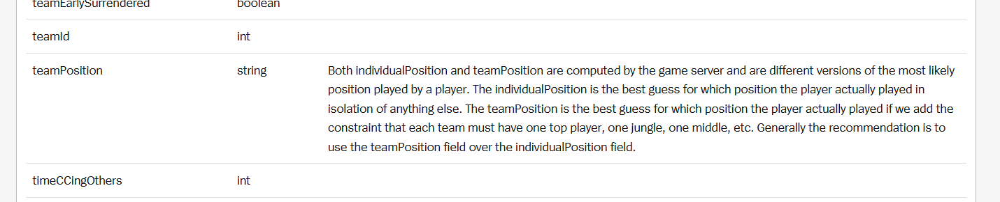

## Outliery:
- Sprawdzić trajektorie, czy ktoś co minute nie cofał się do bazy itd..

## Przydatne adnotacje:
*.1 Można stworzyć nowe rodzaje score'u z trajektori tak jak tutaj 
https://www.doranslab.gg/articles/location-based-champ-metrics.html ,które pomogły by nam odróżnić role (dla trajektorii) :/

*.2 w zwykłym zapisie meczu mamy

Predyckje main roli --> Predykcje Rangi

## IDEAS
### Glitches
What to do with glitched roles :
- delete them
- ensemble vote based on champion played 
- fill based on the missing role form a given match 
train the models based on different approaches and see if anything changes.
Likely not 72 / 482k is not a lot

## Feature Engeneering 
- Odwrócić koordynty jednej ze storn tak by obie druzyny "zaczynały" z tego samego spawna (wtedy trzeba usunąć zmienną team) 
- Uśrednić wartości koordynatów do którejś minuty

## Different models
- przetestować poprawe modelu w zależności do której minuty bierzemy koordynaty